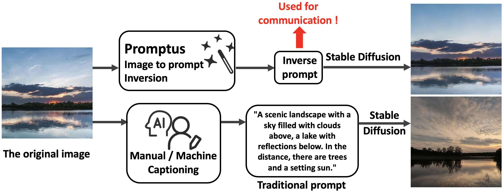

# Promptus: Representing Real-World Video as Prompts for Video Streaming

This is the official implementation of the paper Promptus: Representing Real-World Video as Prompts for Video Streaming, which represents real-world videos with a series of "prompts" for delivery and employs Stable Diffusion to generate pixel-aligned videos at the receiver.



<div style="text-align: center;">
  
  <p><strong>The original video &nbsp;&nbsp;vs &nbsp;&nbsp;The video generated from inverse prompts</strong></p>
</div>

## Inversion
### (0) Getting Started
Clone this repository, enter the `'Promptus'` folder and create local environment:
```bash
$ conda env create -f environment.yml
$ conda activate promptus
```
Alternatively, you can also configure the environment manually as follows:
```bash
$ conda create -n promptus
$ conda activate promptus
$ conda install python=3.10.14
$ conda install pytorch=2.5.1 torchvision pytorch-cuda=12.1 -c pytorch -c nvidia
$ pip install tensorrt==10.7.0
$ pip install tensorrt-cu12-bindings==10.7.0
$ pip install tensorrt-cu12-libs==10.7.0
$ pip install diffusers==0.26.1
$ pip install opencv-python==4.10.0.84
$ pip install polygraphy==0.49.9
$ conda install onnx=1.17.0
$ pip install onnx_graphsurgeon==0.5.2
$ pip install cuda-python==12.6.2.post1
# At this point, the environment is ready to run the real-time demo.
$ pip install torchmetrics==1.3.0.post0
$ pip install huggingface_hub==0.25.0
$ pip install streamlit==1.31.0
$ pip install einops==0.7.0
$ pip install invisible-watermark
$ pip install omegaconf==2.3.
$ pip install pytorch-lightning==2.0.1
$ pip install kornia==0.6.9
$ pip install open-clip-torch==2.24.0
$ pip install transformers==4.37.2
$ pip install openai-clip==1.0.1
$ pip install scipy==1.12.0
```
If you only want to experience real-time generation, please skip to the 'Real-time Demo' part.
### (1) Stable Diffusion Model
Download the official SD Turbo model `'sd_turbo.safetensors'` from [here](https://huggingface.co/stabilityai/sd-turbo/tree/main), and place it in the `'checkpoints'` folder.
### (2) Data preparation
As a demo, we provide two example videos (`'sky'` and `'uvg'`) in the `'data'` folder, which you can test directly. 

You can also use your own videos, as long as they are organized in the same format as the example above.
### (3) Training (Inversion)
```bash
$ python inversion.py -frame_path "data/sky" -max_id 140 -rank 8 -interval 10
```

Where `'-frame_path'` refers to the video folder, `'-max_id'` is the largest frame index. `'-rank'` and `'-interval'` together determines the target bitrate (Please refer to the paper for details).

As an example, the inverse prompts are saved in the `'data/sky/results/rank8_interval10'` folder.

### (4) Testing (Generation)

After training, you can generate videos from the inverse prompts. For example:
```bash
$ python generation.py -frame_path "data/sky" -rank 8 -interval 10
```
the generated frames are saved in the `'data/sky/results/rank8_interval10'` folder.

We provide pre-trained prompts (in 225 kbps) for `'sky'` and `'uvg'` examples, allowing you to generate directly without training.


## Real-time Demo
### (0) Getting real-time engines

We release the real-time generation engines. 

If your GPU is an Nvidia GeForce 4090/4090D, the compatible engines can be downloaded directly. Please download the engines from [here](https://drive.google.com/drive/folders/1w-SWduvQ5ZZKLokae1rBXAKG10YGMQzF?usp=sharing), and place the `'denoise_batch_10.engine'` and `'decoder_batch_10.engine'` in the `'engine'` folder.

If you use a different GPU, Promptus will automatically build engines for your machine. Please download the `'denoise_batch_10.onnx'` and `'decoder_batch_10.onnx'` files from [here](https://drive.google.com/drive/folders/1w-SWduvQ5ZZKLokae1rBXAKG10YGMQzF?usp=sharing), and place them in the `'engine'` folder.
In this case, please wait a few minutes during the first run for the engines to be built.

### (1) Real-time generating
We provide pre-trained prompts (in 225 kbps) for `'sky'` and `'uvg'` examples, allowing you to generate directly without training.
For example:
```bash
$ python realtime_demo.py -prompt_dir "data/sky/results/rank8_interval10" -batch 10 -visualize True
```
the generated frames are saved in the `'data/sky/results/rank8_interval10'` folder.

You can also train your own videos as described above and use the generation engines for real-time generation.

On a single NVIDIA GeForce 4090D, the generation speed reaches 170 FPS. 